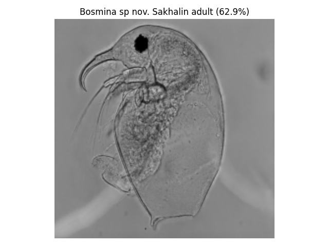
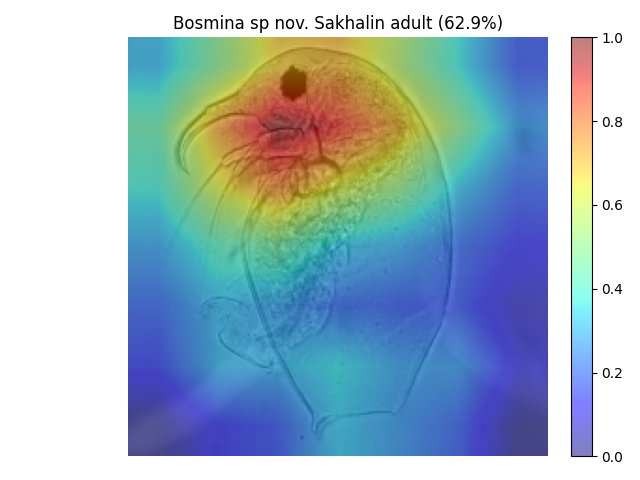
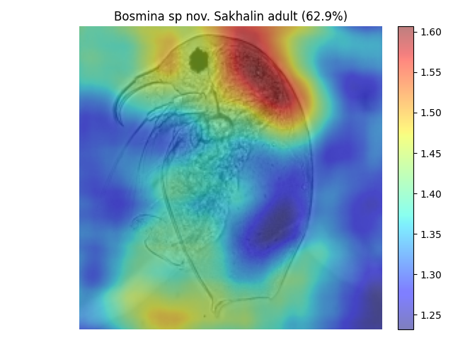

# Explainable AI for Image Classification

Этот репозиторий содержит реализации и эксперименты по **методам интерпретируемости (XAI)** для задачи классификации изображений рачков.  
В работе сравниваются современные методы интерпретируемости(RISE, Abs-CAM) и проводится их оценка по метрикам объяснимости.

## Возможности
- Реализация XAI-методов:
  - **Abs-CAM Init**
  - **Abs-CAM Final**
  - **RISE с оригинальной генерацией масок**
  - **RISE с генерацией масок через Гауссовское распределение**
- Метрики качества объяснений:
  - **Insertion**
  - **Deletion**
- Утилиты:
  - Визуализация масок и карт важности
- Jupyter-ноутбуки с демонстрациями


## Структура проекта

```
XAI_methods_for_CV/
├── notebooks/         # демонстрации в Jupyter
├── src/
│ ├── methods/         # реализации XAI методов
│ │ ├── abs_cam.py
│ │ └── rise_model.py
│ ├── common/
│ │ ├── evaluation.py  # метрики Insertion / Deletion
│ │ └── utils.py       # вспомогательные функции
├── .gitignore
├── README.md
├── requirements.txt  
└── requirements_cluster.txt  
```

## Установка

Склонируйте репозиторий и установите зависимости:

```bash
git clone https://github.com/vru116/XAI_methods_for_CV.git
cd XAI_methods_for_CV
pip install -r requirements.txt
```


## Примеры результатов

| Исходное изображение | Abs-CAM Init(для 4 слоя) карта важности | RISE карта важности 
|---------------------|-------------------|----------------------|
|  |  |  |


## Ссылки на статьи

- **RISE: Randomized Input Sampling for Explanation of Black-box Models**  
  [arXiv:1806.07421](https://arxiv.org/pdf/1806.07421)

- **Abs-CAM: A Gradient Optimization Interpretable Approach for Explanation of Convolutional Neural Networks**  
  [arXiv:2207.03648](https://arxiv.org/pdf/2207.03648)

## Примечание

> Примечание: базовая реализация метода **RISE** была заимствована из открытого репозитория [оригинальной реализации](https://github.com/eclique/RISE/tree/master).  
> В данном проекте она была модифицирована и дополнена генерацией масок через гауссовское распределение.


---